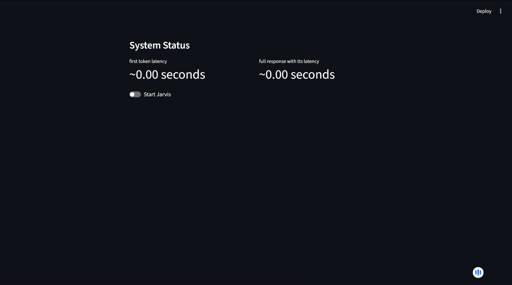
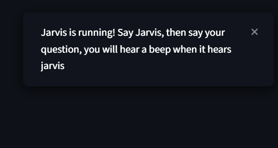
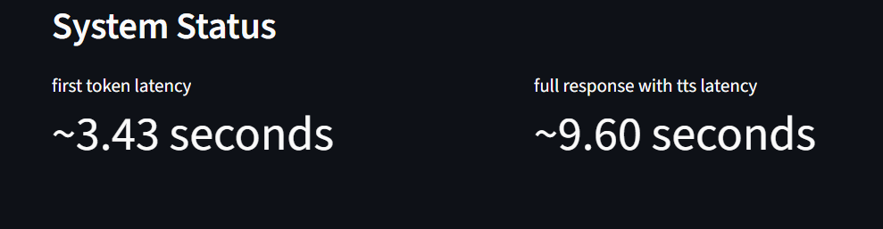

# 🍋 Larvis: High-Performance Local AI Assistant

[](https://www.python.org)
[](https://lemonade-server.ai/)
[](https://opensource.org/licenses/MIT)

**Larvis** (Lemonade + Jarvis) is a privacy-first, ultra-fast local voice assistant built for the **AMD Lemonade Developer Challenge 2026**. It runs entirely on your local hardware using high-efficiency ONNX and GGUF models.



---

## Video Tutorial & Demo
Full installation & demo video:  
👉 **[RuCode YouTube Channel](https://youtube.com/@RuCode)** *(Coming soon!)*

---

## Features
* **Wake Word:** Custom `jarvis_v2.onnx` detection via OpenWakeWord.
* **Brain:** [Lemonade Server](https://lemonade-server.ai/) running `Qwen3-1.7B-GGUF`.
* **VAD:** `Silero-VAD` for smart recording (stops when you stop talking).
* **STT:** `OpenAI Whisper (Base.en)` for fast local transcription.
* **TTS:** `Pocket-TTS` for instant, high-quality vocal responses.

---

## Setup & Installation

### 1. Clone the Repository
```bash
git clone [https://github.com/hqwn/Jarvis-V2.git](https://github.com/hqwn/Jarvis-V2.git)
cd Jarvis-V2
```

### 2. Install Lemonade & LLM
1. Install the Lemonade Server: [https://lemonade-server.ai/](https://lemonade-server.ai/)
2. Download the optimized Qwen model:
```bash
lemonade download unsloth/Qwen3-1.7B-GGUF --file Qwen3-1.7B-Q4_0.gguf --name QWEN3-1.7B-GGUF
```

### 3. Install Dependencies & Run
```bash
pip install -r requirements.txt
streamlit run src/Ui.py
```

---

## How to Use
1. **Start:** Toggle the **"Start Jarvis"** button.
   
2. **Interact:** Say "Jarvis" followed by your question. 
3. **Feedback:** Watch the toast notifications for "Heard Jarvis!" and real-time processing.
    
4. **Metrics:** Monitor the **Latency Dashboard** to see your system's performance.
   

---

## Customization (Swapping Models)

Larvis is modular. You can change models directly in `src/Main.py` to fit your hardware:

### A. Change the AI Brain (LLM)
If you have a powerful GPU/High RAM, you can use a 7B or 14B model. Change the `model` name in the `ai_response` function:
```python
# Change this line in Main.py
model="Qwen3-1.7B-GGUF" -> "Your-New-Model-Name"
```

### B. Change the Speech-to-Text (Whisper)
If your RAM usage is too high, swap from `base.en` to `tiny.en`:
```python
# Change this line in Main.py
speech_model = whisper.load_model("tiny.en") 
```

### C. Change the Voice
Swap the `audio_prompt` name in the `model_init` section to change the TTS personality.

---

## ❓ Questions & Support
* **Tutorial:** Check the [RuCode YouTube Channel](https://youtube.com/@RuCode).
* **Issues:** If the app lags, try closing Chrome or VS Code to free up system RAM.
* **Community:** Subscribe for more local AI and hardware tutorials!

---

## Author
**Developed by Aryan Jain** — *Created for the AMD Lemonade Developer Challenge 2026.*